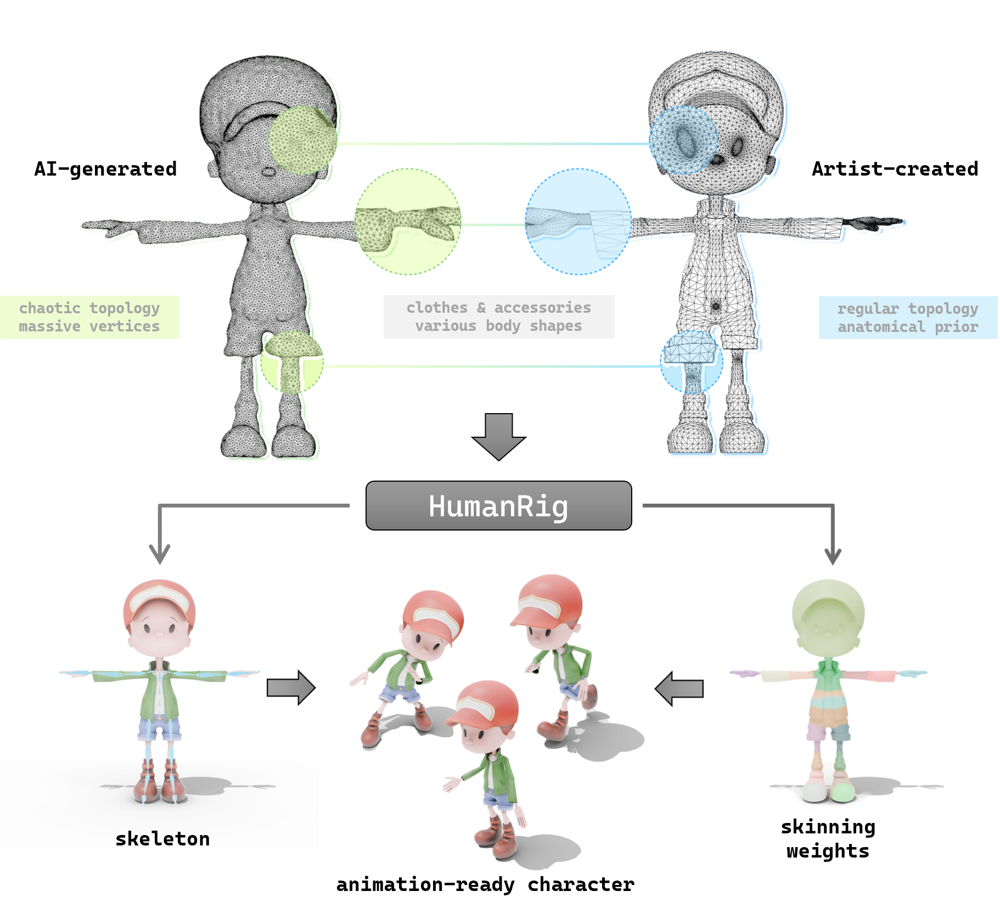

<div align="center">

# HumanRig: Learning Automatic Rigging for Humanoid Character in a Large Scale Dataset <br>（CVPR 2025）

_**Zedong Chu,
Feng Xiong,
Meiduo Liu,
Jinzhi Zhang,
Mingqi Shao,
Zhaoxu Sun,
Di Wang,
Mu Xu**_

<a href='https://arxiv.org/abs/2412.02317'></a>
<a href='https://c8241998.github.io/HumanRig/'></a>
<a href='https://huggingface.co/datasets/jellyczd/HumanRig'></a>



</div>

# TODO

- [x] Release dataset on Hugging Face 🤗
  - Dataset Link: [jellyczd/HumanRig](https://huggingface.co/datasets/jellyczd/HumanRig)
- [ ] Release code 🚧

## Citation

```bibtex
@misc{chu2024humanriglearningautomaticrigging,
      title={HumanRig: Learning Automatic Rigging for Humanoid Character in a Large Scale Dataset}, 
      author={Zedong Chu and Feng Xiong and Meiduo Liu and Jinzhi Zhang and Mingqi Shao and Zhaoxu Sun and Di Wang and Mu Xu},
      year={2024},
      eprint={2412.02317},
      archivePrefix={arXiv},
      primaryClass={cs.CV},
      url={https://arxiv.org/abs/2412.02317}, 
}
```
